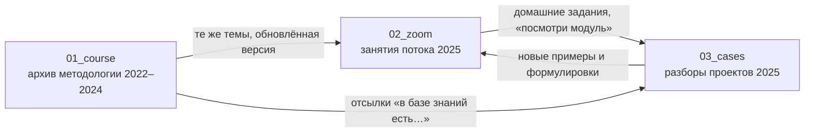

# KNOWLEDGE_MAP — карта базы знаний `producer-strategy`

Карта описывает, что лежит в базе, как материалы связаны между собой и какие механики в них повторяются. Стратегии и рекомендаций здесь нет — только структура.

---

## 0. О базе в целом

| Параметр | Значение |
|---|---|
| Состав | 60 текстовых файлов: 25 в `01_course`, 21 в `02_zoom`, 14 в `03_cases` |
| Объём | ≈10,5 МБ текста, ≈990 тыс. слов (порядка 100+ часов речи): COURSE ≈425 тыс., ZOOM ≈305 тыс., CASES ≈260 тыс. |
| Формат | Автоматические расшифровки устной речи: без пунктуации и абзацев, с ошибками распознавания (см. раздел 7) |
| Автор программы | Егор Пыриков — продюсер онлайн-школ, ведущий «Менторства Егора Пырикова». Большинство лекций читает он сам, остальные — приглашённые спикеры |
| Контекст | Российский рынок онлайн-образования («инфобизнес»), 2022–2025: Instagram, Telegram, GetCourse, отделы продаж, закупка рекламы |
| Аудитория программы | Эксперты и продюсеры онлайн-школ (от «маленьких активов» до проектов с выручкой в сотни миллионов) |

**Как соотносятся три раздела (вывод по датам и упоминаниям внутри текстов):**

- `01_course` — **архив базы знаний прошлых потоков** (метки [2022], [2023], [2024] в названиях). Основные модули и выступления спикеров.
- `02_zoom` — **живые занятия текущего потока (2025)**: Егор и спикеры заново читают те же темы, часто с обновлённой методологией («этого не было в прошлом потоке»), и отвечают на вопросы. Признаки: «Разбор запуска менторства 2025», «в условиях 25-го года», отсылки к «прошлому разбору на 200».
- `03_cases` — **разборы и вопрос-ответы того же потока 2025** (даты с 28.04 по 21.07): участники приносят свои проекты, Егор и эксперты-наставники применяют к ним методологию.

**Как изучалась база.** Все 60 файлов прошли автоматический частотный анализ по ~90 ключевым понятиям; из каждого файла прочитаны фрагменты в шести точках (начало, ⅙, ⅓, ½, ⅔, ⅚); отдельные методики (связки продаж, 7 посылов прогрева, 5 фаз роста, именные техники) извлечены из текста целиком. Это даёт надёжную картину тем и связей, но не дословное знание каждой минуты лекций — частные цифры и примеры стоит перепроверять по первоисточнику.

**Пропуски в нумерации:** в `01_course` нет файлов 1, 18, 19, 20, 28; в `02_zoom` нет 1, 5, 7. Возможно, эти занятия не попали в репозиторий.

---

## 1. Состав разделов

### 1.1. `01_course` — методология (архив 2022–2024)

| Файл | Спикер | Формат | О чём | Ключевые понятия |
|---|---|---|---|---|
| 2. Анализ аудитории и кастдевы [2024] | Егор | Модуль | Анкета аудитории, сегментация по доходу/уровню, как звать и проводить кастдевы, вывод в контент | кастдев (КСД), анкета, сегменты, карта смыслов, «топливо для контента» |
| 3. Работа в директе [2024] | Егор | Модуль | Директ как инструмент продаж «из дефицита и персонализации»; связки продаж в директе | касание, «сервис 5 звёзд», ранняя бронь, техника Барни, директ-менеджер |
| 4. Продажи [2024] | Егор | Модуль (≈60 слайдов) | Связки продаж 1–5, анкета дропами, брони vs полная оплата, мастер-класс vs вебинар | связка, анкета предзаписи, ОП, бронь, закрытая презентация |
| 5. Декомпозиция [2024] | Егор | Модуль | Расчёт выручки от охватов и конверсий; нормы доходимости; план на год | декомпозиция, доходимость, конверсия, окна продаж |
| 6. Фишки продаж [2024] | Егор | Список (20+ фишек) | VIP-тариф «резиновый», видео эксперта для ОП, рассылки по именам, служба заботы, Барни | фишка №…, недозвоны, апсейл 24 ч |
| 7. Отдел продаж [2024] | Рустам Имамов | Лекция | Порядок обработки лидов, отчётность менеджеров, найм и обучение, скрипты | ОП, предоплаты, зрители веба, скрипт |
| 8. Распродажи [2024] | Егор | Короткий модуль | Типы распродаж, эксклюзивные продукты, анкета дропами, геймификация, лоты | распродажа, эксклюзив, геймификация |
| 9. Воркшоп по вебинарам [2024] | Егор | Разбор 4 презентаций | Как усилить продающий вебинар (в т.ч. курс по свечеварению) | польза + продажа, возражения, аватар, бонусы |
| 10. Прогревы [2024] | Егор | Модуль | Этапы делегирования контента, стратегия запуска с конверсионными точками, техники прогрева | стратегия прогрева, ажиотаж, техника ревизора, разборы |
| 11. Воркшоп по прогревам [2024] | Егор + участники | Воркшоп | Разборы карт смыслов и прогревов участников | карта смыслов, боли, тарифы, наставники |
| 12. Стратегии роста [2024] | Егор | «Творческая лекция» | Проблемы инфобизнеса, 5 фаз роста, видение, ошибки планирования, реинвест | лунтик → муравей → педаль газа → умный дом → экосистема |
| 13. Закупка рекламы у блогеров [2024] | Команда Т. Финаевой | Лекция (11 глав) | Тесты и основной бюджет, рекламная подача, форматы интеграций, задания-баттлы, цены | рекламная подача, тест, охват, CTR |
| 14. Разборы по закупке рекламы [2024] | Команда Т. Финаевой | Разборы | Подачи и воронки конкретных экспертов | подача, воронка, марафоны, коллаборации |
| 15. Трафик в Telegram [2024] | Сурен Альбертян | Мини-курс | Telegram Ads, посевы, закрытый/открытый канал, приветственный бот, оформление канала | TG Ads, посевы, закреп, CPF |
| 16.1. Продуктовая стратегия [2024] | Александра Горева-Куртышева | Вопрос-ответ | Кастинг учеников, фокус-группы выпускников, короткий продукт как ступень | кастинг, фокус-группа, «я к тебе вернусь» |
| 16.2. Продуктовая стратегия [2024] | Горева-Куртышева | «Методологические рычаги» | ИКР минимум/максимум, катализаторы и ингибиторы, продукт на понижение, роли кураторов и методолога | ИКР, катализаторы, старший куратор, методолог |
| 17. Команда в инфобизнесе [2024] | Баграт Ахмедов | Лекция | 11 принципов управления, оргструктура, мотивация, маркетинг/продукт/ОП/финансы, риски самозанятых | грейды кураторов, БДР/БДДС, KPI |
| 21. Система запусков в Telegram [2024] | Кирилл Сибиряк | Кейс + система | Лид-магнитная воронка с окупаемостью в цикле недели, марафон, 14-дневный прогрев, пропорция контента | окупаемость, мини-курс, марафон, трипвайер |
| 22. Инвестиции и капитал [2024] | Евгений Лашков | Лекция | Личные инвестиции предпринимателя | — (вне маркетинга) |
| 23. Налоги 2025 [2024] | Наталья Иванова (Пушкарева) | Лекция | НДС, самозанятые, дробление, персональные данные, оферты | — (вне маркетинга) |
| 24. Связки в директе [2023] | Валентина Хиленко | Выступление | Холодный трафик → директ → диагностика → продажа; лимиты; MVP за месяц | диагностика, точка А/Б, лимиты |
| 25. Выступление Марго Савчук [2023] | Марго Савчук (интервью) | Интервью | Сторис, живость и эмоции, человеческая связь с аудиторией, рекламные подачи | сторис, лояльность, личность |
| 26. Чёрная пятница [2023] | Татьяна Тенилова | Кейс | Распродажа как предпродажа будущих продуктов, вау-эффект, клуб, ограничение мест | предпродажа, вау-эффект, клуб |
| 27. Разбор запуска на 200 млн [2023] | Егор | Разбор запуска | Инфоповод «разбор запуска» в трафик, генеральная идея прогрева, разборы «бутерброд», продающее голосовое | инфоповод, генеральная линия, рекомендации |
| 29. Разбор запуска на 60 млн [2022] | Егор | Разбор запуска | 7 посылов прогрева, прогрев сторис и ТГ, чат-презентация, продающий зум | 7 посылов, ажиотаж, кейсы, видео-знакомство |

### 1.2. `02_zoom` — занятия текущего потока (2025)

| Файл | Спикер | О чём | Пара в `01_course` |
|---|---|---|---|
| 2. Организационная встреча | Егор | Старт потока + логика последнего запуска: бот и база, «чёрный лебедь» (накрутка ботов), перевод аудитории из сторис блогера, разборы, директ | 27, 29 |
| 3. Разбор запуска менторства 2025 | Егор | Сюжетные линии, воронки под платный трафик, 1900 анкет, кодовое слово, продукт «этапами», ошибки (анкеты «протухли», сырой оффер брони) | 27, 29 |
| 4. Кастдевы и анализ аудитории | Егор | Анкета и нормы заполнения, 2–3 кастдева на сегмент, «техника лопата», раскрытие пути клиента, усиление продукта | 2 |
| 6. Воронки, связки продаж | Егор | Окна продаж, чек-лист окна анкеты, платный мастер-класс, демо-день, три вида бонусов, рост цены от окна к окну | 4, 5, 6 |
| 8. Лид-магнит и воронка | Егор | Структура лид-магнита, раскрытие методологии, бонусы за досмотр/директ/анкету, где выдавать | 21 (частично) |
| 9. Стратегия роста и масштабирования | Егор | 5 фаз, «топ-1%», долгий рост, экосистема | 12 |
| 10.1 / 10.2. Михаил Тимочко и Николай Велижанин | Тимочко, Велижанин | YouTube, видео в запуске, фоновый и активный прогрев. **Расшифровка почти нечитаема** | — |
| 11. Воркшоп по вебинарам | Егор | Разборы вебинаров участников | 9 |
| 12. Отдел продаж | Рустам Имамов | ОП на аутсорсе: метрики «светофор», договор, продажи по анкете, лаг на заявки, мессенджеры | 7 |
| 13. Создание отдела диагностов | Егор (бонусное видео) | Кто такой диагност, офферы диагностики, подхват «не купивших», внедрение по шагам | 24 |
| 14. Прогревы | Егор | Прогрев как система и процесс команды: план, конверсионные точки, близкие друзья, лайв + экспертность | 10 |
| 15. Трафик в TG: посевы, таргет | Сурен Альбертян | Обновлённый TG-трафик, связки и цены по нишам | 15 |
| 16. Воркшоп по прогревам | Эксперты по смыслам (Натя, Настя) + Егор | Разборы проектов: формулировки аудитории, календарь прогрева, выбор окна | 11 |
| 17. Закупка рекламы у блогеров | Т. Финаева и команда | Форматы 2025, подачи, узкие ниши, куда вести трафик | 13 |
| 18. Групповые разборы по закупке [27.06] | Команда Финаевой (8–10 закупщиков) | Разборы проектов участников | 14 |
| 19. Продукт | Егор | Ценность ×2–3 при той же цене, продуктовая линейка вокруг флагмана, клубы, кураторы, методолог | 16.1, 16.2 |
| 20. Воркшоп по продукту и линейке | Горева-Куртышева | Сообщества, WhatsApp, retention-боты, каннибализация, «двери» в премиальный продукт | 16.1, 16.2 |
| 21. Команда | Егор | Маленькая эффективная команда, найм через тестовые, доля затрат, управляющий | 17 |
| 22. Трафик в Яндекс.Директ | Игорь Галаев | Подготовка (80% результата), ключи по лестнице Ханта, креативы, поэтапное масштабирование | — (новое) |
| 23. Запуски на зарубежном рынке | Дарья Серединская | Рынок США, конкретный оффер, трипвайер + апселлы в корзине, адаптация продукта | — (новое) |

### 1.3. `03_cases` — практические разборы (поток 2025)

| Файл | Ведущие | Формат | Проекты и вопросы (по прочитанным фрагментам) |
|---|---|---|---|
| Групповые разборы с Егором [28.04] | Егор | 4 разбора | Падение выручки после роста; база бота 13 тыс.; клуб за 1,5 тыс./мес; HR-консалтинг; клуб для мастеров; ежемесячные продажи vs тёплый запуск |
| Групповые разборы основной группы [30.04] | Егор | 4 разбора | «Муравей», увлечённый своим хобби; офферы через кастдевы; новый флагман вместо цели «100 млн»; семинар для врачей (краниобаланс) |
| Групповые разборы основной группы [16.05] | Егор | 2 результата + 2 разбора | Кондитерская онлайн-школа (запуски каждый месяц); «Квант» — управление бизнесом; «Ключ» — заработок на недвижимости; трансформационные игры |
| Групповые разборы с Егором [23.05] | Егор | Разборы | Косметолог без запусков; «эзотерическое творчество» (падение летом, рост цены в Я.Директе); проект по нейросетям с большой командой |
| Групповые разборы основной группы [12.06] | Егор | Разборы | Школа комплексного SMM; продукт про род/психологию; рост ежемесячной выручки через директ |
| Групповые разборы с Егором [07.07] | Егор | Разборы | Продукт-продолжение для выпускников; кружки по анализам (питание); рассрочки; школа йоги; менторство 300 тыс.; эпоксидная смола; распродажа флагмана со скидкой |
| Групповые разборы с Егором [16.07] | Егор + участники | Разборы | Карусели вместо Reels; управляющий vs продюсер; YouTube/TG-блогер с фитнес-приложением; проект по отношениям только в TG |
| Вопрос-ответ основной группы [03.05] | Егор | Q&A | Как проверять оффер на кастдевах; 4–5 флагманов → 1–2; челлендж; CRM; два Instagram |
| Вопрос-ответ основной группы [08.06] | Егор | Q&A | Закупка на 1,5 млн; ОП vs диагност; мастер-класс vs закрытая презентация; «Повелитель игр»; здоровье «без таблеток» |
| Вопрос-ответ с Егором [19.06] | Егор | Q&A | Добить продажу за 300 тыс.; преподаватели танцев; творческая ниша (трипвайер → флагман); отказы после предоплат; эфиры |
| Вопрос-ответ с экспертами [05.05] | Наставники (Зоя, Вера и др.) | Q&A | Доля продюсера; лид-магниты; воронка в нишу нейросетей; таблица смыслов; раздел проекта с партнёром |
| Вопрос-ответ с экспертами [26.05] | Наставники | Q&A | Два продюсера в проекте; кастдевы на чужой аудитории; диагностика; диалоги при кодовых словах; офферы в психологии; «туннельные» воронки |
| Вопрос-ответ с экспертами [21.07] | Наставники | Q&A | Контент-завод; бухгалтерия 1С; таргет в Казахстане; как продюсеру выбрать эксперта; общие расходы партнёров; пакет консультаций; предзаполненные ссылки TG |
| Вопрос-ответ по закупке рекламы | Команда Финаевой | Q&A | Визажист; эпоксидная смола (продукт как профессия); бот с проверкой подписки; бесплатный марафон; ВК |

---

## 2. Тематическая карта

Пятнадцать тем. Для каждой — где материал лежит в трёх разделах и что в нём главное (описательно).

### Т1. Аудитория, кастдевы, карта смыслов
- **COURSE:** 2 · 11 · 29 (кастдевы как источник «живых» болей)
- **ZOOM:** 4 · 16
- **CASES:** 03.05, 30.04, 23.05, 05.05, 26.05, 21.07
- **Суть.** Анкета аудитории (возраст, доход, уровень, капитал) → кастдевы по 30–40 минут, 2–3 на сегмент, проводит сам эксперт/продюсер → карта смыслов (боли, страхи, желания, возражения) → отбор топ-5 → решение, как закрывать каждый пункт продуктом и контентом. Кастдев одновременно даёт формулировки аудитории, материал для контента («безотходное производство») и первые продажи.

### Т2. Продукт, оффер, продуктовая линейка, методология обучения
- **COURSE:** 16.1 · 16.2 · 26 · 6 (VIP-тариф) · 8
- **ZOOM:** 19 · 20 · 4 · 23
- **CASES:** 30.04, 16.05, 23.05, 03.05, 19.06, 07.07, 28.04
- **Суть.** Флагман в центре; малые продукты существуют, чтобы продавать флагман. Ценность продукта поднимается в 2–3 раза при той же цене за счёт инфраструктуры и «фишек». Оффер описывает результат, «путь клиента» — за счёт чего он наступит (продукт подаётся этапами). Методология: ИКР-минимум и ИКР-максимум, катализаторы и ингибиторы ученика, кураторы и методолог, фокус-группы выпускников для второй ступени, риск каннибализации премиального продукта.

### Т3. Прогрев
- **COURSE:** 10 · 11 · 25 · 27 · 29 · 21 (контент в TG)
- **ZOOM:** 14 · 16 · 3 · 2
- **CASES:** 23.05, 16.05, 08.06, 16.07
- **Суть.** Прогрев как план на месяц → неделю → день, с конверсионными точками (анкета, разборы, вебинар, окна). Наполнение — боли из кастдевов, кейсы, отработка возражений, ажиотаж, инфоповоды, сторителлинг, лайв-контент. Повторяемые элементы: генеральная линия прогрева, сюжетные линии, разборы, близкие друзья/закрытый ТГ как отдельный прогрев сегмента, согласование прогрева с экспертом.

### Т4. Лид-магнит и входные воронки
- **COURSE:** 21 · 24 · 13/14 (воронки под рекламу)
- **ZOOM:** 8 · 15 · 17 · 22 · 23
- **CASES:** 05.05, 26.05, 28.04, 16.07, Q&A по закупке
- **Суть.** Лид-магнит раскрывает методологию продукта (те же этапы, из которых состоит продукт) и закрывает топ-5 болей, возражений и желаний; бонусы за досмотр, за сообщение в директ/ТГ, за анкету. Входы: кодовое слово → бот/директ, канал с закрепом, лендинг, YouTube. Трипвайер как «платная анкета».

### Т5. Окна продаж и связки
- **COURSE:** 4 · 5 · 3 · 26 · 8
- **ZOOM:** 6 · 3 · 13
- **CASES:** 08.06, 12.06, 28.04, 07.07, 23.05
- **Суть.** Несколько окон продаж вместо одного (анкета предзаписи, разборы, платный мастер-класс, вебинар/закрытая презентация, демо-день, диагностики, дожим). Каждое следующее окно — дороже и со своими бонусами. Связки из модуля «Продажи»: 1.1 (личные продажи по анкете + вебинар), 2 (закрытые продажи по анкете через ОП), 2.1 (то же + вебинар), 3 / 3.1 (флагман с высоким чеком, закрытая презентация, 2–3 окна), 4 (продажи в сторис), 5 (платный мастер-класс).

### Т6. Вебинар и продающая презентация
- **COURSE:** 9 · 4 · 29 (продающий зум)
- **ZOOM:** 11 · 3 · 6
- **CASES:** 12.06, 16.05
- **Суть.** Польза ≈ до 1:30–1:45, затем продажа; в презентации — все основные боли и возражения, самые сильные повторяются; личная история эксперта; продукт «этапами»; бонусы и геймификация на удержание.

### Т7. Директ и личные продажи
- **COURSE:** 3 · 6 · 24 · 29
- **ZOOM:** 2 · 13
- **CASES:** 28.04, 12.06, 16.05, 26.05, 07.07, 16.07
- **Суть.** Логика «дефицита и персонализации»: каждое касание (после лид-магнита, анкеты, реакции на сторис) открывает диалог; квалификация в переписке; ранняя бронь; голосовые; «зеркальный» ТГ-аккаунт; директ-менеджер.

### Т8. Отдел продаж и диагносты
- **COURSE:** 7 · 24 · 6 · 17
- **ZOOM:** 12 · 13
- **CASES:** 08.06, 03.05, 26.05
- **Суть.** Порядок обработки (заявки → предоплаты → зрители вебинара → анкета → регистрации), метрики и отчётность, договор с ОП, обучение. Диагност — продавец-носитель экспертизы, даёт пользу на созвоне; до созвона — продающее голосовое про программу.

### Т9. Распродажи и Чёрная пятница
- **COURSE:** 8 · 26
- **CASES:** 07.07 (распродажа флагмана со скидкой), 05.05
- **Суть.** Комбинация старых и текущих продуктов + 1–2 эксклюзивных «только сейчас»; анкета предзаписи дропами; призы, розыгрыши, таймер; предпродажа будущей программы «за доверие».

### Т10. Декомпозиция, метрики, экономика запуска
- **COURSE:** 5 · 21 · 17 (финансы)
- **ZOOM:** 16 (расчёт потолка запуска на примере)
- **CASES:** 08.06, 23.05, 30.04
- **Суть.** Выручка раскладывается в охваты × конверсии × чек; нормы доходимости (тёплые запуски: 20–30% минимум, 35–45% средне, 50–60% идеал); цель — чтобы новый охват стоил дешевле, чем приносит; план на год.

### Т11. Трафик и привлечение
| Канал | COURSE | ZOOM | CASES |
|---|---|---|---|
| Закупка у блогеров | 13, 14 | 17, 18 | Q&A по закупке, 08.06 |
| Telegram (Ads, посевы) | 15, 21 | 15 | 16.07, 05.05 |
| Яндекс.Директ | — | 22 | 23.05, 21.07 |
| Reels / карусели / органика | 10, 25 | 3, 8 | 16.07, 07.07, 12.06 |
| YouTube | — | 10.1/10.2, 8 | 26.05, 16.07 |
| Зарубежный рынок | — | 23 | 21.07 (Казахстан) |
- **Суть.** Тестовый бюджет → основной; рекламная подача как ключевой актив; трафик ведётся в канал/блог (стабильнее, чем чистая автоворонка); окупаемость и реинвестирование.

### Т12. Стратегия роста и масштабирование
- **COURSE:** 12 · 21
- **ZOOM:** 9 · 19
- **CASES:** 30.04, 23.05, 16.07, 28.04
- **Суть.** 5 фаз: лунтик (интуитивные продажи) → муравей (эффективность на малых активах) → педаль газа (рост активов, линейное масштабирование трафика) → умный дом (система и делегирование) → экосистема (услуги, партнёрства, товары вокруг школы). Больше запусков флагмана в год; разбор причин каждого результата; видение на 1–3 года.

### Т13. Команда, управление, финансы
- **COURSE:** 17 · 10 (делегирование контента) · 16.2 (кураторы)
- **ZOOM:** 21 · 19
- **CASES:** 16.07 (управляющий vs продюсер), 05.05, 26.05, 21.07 (доли и партнёрство)

### Т14. Право, налоги, личные финансы
- **COURSE:** 22 (инвестиции) · 23 (налоги 2025) · 17 (риски самозанятых)
- Вне маркетинга; привязано к законодательству РФ конкретного года.

### Т15. Разборы запусков автора (эталонные кейсы)
- **COURSE:** 29 (2022, 60 млн) · 27 (2023, 200 млн)
- **ZOOM:** 2 (логика запуска перед потоком) · 3 (менторство 2025)
- Эти четыре файла — сквозная линия: каждый следующий разбор ссылается на предыдущий и показывает, что добавилось и что не сработало.

---

## 3. Связи между COURSE, ZOOM и CASES

### 3.1. Общая схема

- **COURSE → ZOOM.** Почти у каждого модуля 2025 года есть предшественник в архиве (таблица 1.2, колонка «Пара»). Новые версии короче, разбиты на части и добавляют то, чего не было раньше: сюжетные линии, окно мастер-класса, отдел диагностов, Яндекс.Директ, зарубежный рынок.
- **ZOOM → CASES.** Разборы опираются на модули потока: участники отчитываются, что посмотрели «урок по директу», «видос про диагностов», «модуль по кастдевам», и применяют их; Егор отсылает к другим разборам («разбор Оксаны» из [30.04] — как типовой план для малых активов).
- **COURSE → CASES.** Прямые отсылки к архиву: модуль Валентины Хиленко о диагностике, прошлые разборы запусков, выступление Марго.

### 3.2. Пары «архив ↔ поток» по темам

| Тема | COURSE | ZOOM | Что изменилось/добавилось в ZOOM |
|---|---|---|---|
| Кастдевы | 2 | 4 | Нормы заполнения анкеты, «техника лопата», раскрытие пути клиента, усиление продукта через кастдевы |
| Прогревы | 10, 11 | 14, 16 | Прогрев как командный процесс; эксперты по смыслам на воркшопе |
| Продажи / связки | 4, 5, 6 | 6 | Окна продаж и платный мастер-класс как отдельное окно, демо-день, три вида бонусов |
| Отдел продаж | 7 | 12 | Тот же спикер (Рустам Имамов), фокус на аутсорс и метрики |
| Диагностика | 24 | 13 | Собственная методика Егора по отделу диагностов |
| Вебинары | 9 | 11 | Новая волна разборов презентаций |
| Блогеры | 13, 14 | 17, 18 | Форматы и ограничения 2025 года |
| TG-трафик | 15 | 15 | Обновлённые связки и цены |
| Продукт | 16.1, 16.2 | 19, 20 | Позиция Егора о ценности ×2–3; сообщества и retention у Горевой-Куртышевой |
| Команда | 17 | 21 | Подход «маленькой эффективной команды» вместо оргструктуры большой школы |
| Рост | 12 | 9 | Та же модель 5 фаз, акцент на долгий рост |
| Разборы запусков | 27, 29 | 2, 3 | Следующий запуск, ошибки и новые механики |

### 3.3. Есть только в одном разделе

- **Только COURSE:** директ как модуль (3), распродажи (8), Чёрная пятница (26), сторис Марго (25), система запусков в TG Кирилла Сибиряка (21), инвестиции (22), налоги (23), разборы запусков 2022–2023 (27, 29).
- **Только ZOOM:** лид-магнит как отдельный модуль (8), Яндекс.Директ (22), зарубежный рынок (23), YouTube (10.1/10.2), разбор запуска 2025 (3), оргвстреча (2).
- **Только CASES:** живые проекты участников из десятков ниш, позиции наставников (не только Егора), вопросы партнёрства и долей.

### 3.4. Сквозные люди
- **Егор Пыриков** — во всех трёх разделах; задаёт методологию.
- **Рустам Имамов** (ОП), **Сурен Альбертян** (TG), **команда Татьяны Финаевой** (блогеры), **Александра Горева-Куртышева** (продукт) — выступают и в архиве, и в потоке.
- **Наставники основной группы** (Зоя, Вера и др.) — ведут вопрос-ответы в CASES.
- **Участники-«кейсы»** (Юля, Валя, Миша, Таня, Надя и др.) упоминаются в лекциях как примеры и появляются в разборах.

---

## 4. Повторяющиеся механики

Механики, которые встречаются в нескольких разделах и у разных спикеров. Число в скобках — частота ключевого слова по всей базе (ориентир, не точная метрика).

### 4.1. Понимание аудитории
1. **Кастдев → карта смыслов → топ-5** (кастдев ≈120, карта смыслов ≈80). Источник смыслов для прогрева, лид-магнита, презентации и продукта. Все три раздела.
2. **Анкета аудитории для сегментации** — разовая, 1–2 раза в год; процент заполнения от охвата как показатель лояльности.
3. **Формулировки словами аудитории** — заголовки, офферы, сторис строятся на фразах из кастдевов и переписок.

### 4.2. Продукт и оффер
4. **Флагман в центре линейки** (≈510). Мастер-классы, интенсивы, трипвайеры существуют ради продажи флагмана.
5. **Ценность ×2–3 при той же цене** — добавить инфраструктуру, сопровождение, «фишки» продукта.
6. **Путь клиента / продукт этапами** (≈60). Человек должен понять, за счёт чего придёт результат, а не только какой он.
7. **Оффер под сегмент**: конкретный результат, срок, для кого (особенно жёстко — на рынке США).
8. **Тарифы**: базовый / с куратором / VIP; «резиновый» VIP без лимита мест.

### 4.3. Прогрев и контент
9. **Стратегия прогрева на месяц с конверсионными точками** — план, синхронизация с командой и экспертом.
10. **Инфоповоды** (≈200): события месяца выписываются заранее и встраиваются в прогрев; «разбор запуска» как инфоповод для рекламы.
11. **Ажиотаж** (≈150): регулярный показ спроса (вопросы, скрины, сообщения) как один из самых сильных аргументов.
12. **Кейсы и разборы** (кейс ≈830): разборы «бутерброд» (участник из зала + кейс ученика), «техника ревизора» (съёмка ученика в его среде), отзывы.
13. **Сторителлинг пути эксперта, личность, живость** — от «7 посылов» 2022 года до сюжетных линий 2025 года.
14. **Сюжетные линии** (≈60) — длинная история в сторис ради охватов и вовлечения.
15. **Отработка возражений** в прогреве, на кастдевах, в презентации и в ОП.
16. **Близкие друзья / закрытый ТГ** — отдельный прогрев сегмента или бонус за анкету.

### 4.4. Вход в воронку
17. **Кодовое слово** (≈140) из Reels/сторис/рекламы → бот или директ → лид-магнит.
18. **Лид-магнит, раскрывающий методологию продукта**, с бонусами за досмотр, за сообщение и за анкету.
19. **Перевод аудитории между площадками**: Instagram → Telegram, бот → канал, YouTube → бот.
20. **Трипвайер** как платное подтверждение интереса.

### 4.5. Продажа
21. **Анкета предзаписи** (самый частый механизм продаж в базе) — с сильным оффером, выдачей «дропами», обработкой ОП или директом.
22. **Несколько окон продаж** (≈180 упоминаний «окна продаж»): каждое следующее дороже и со своими бонусами.
23. **Бронь / предоплата** (≈250) и **бонусы за принятие решения**: за полную оплату сейчас, за оплату до старта, за бронь.
24. **Платный мастер-класс 490–1000 ₽, 2–3 дня** как вход в воронку флагмана.
25. **Директ: касание после каждого действия**, открытие диалогов (техника Барни), квалификация, «зеркальный» ТГ.
26. **Диагностика / диагносты** (≈490) и **продающее голосовое до созвона**.
27. **Служба заботы** — именной контакт ОП для всех, у кого остались вопросы.
28. **Геймификация, розыгрыши, эксклюзивы** — на вебинарах, распродажах, мастер-классах.

### 4.6. Экономика и рост
29. **Декомпозиция** выручки до охватов и конверсий.
30. **Окупаемость трафика в коротком цикле и реинвест** (окупаемость/ROMI ≈1100).
31. **Тест → масштабирование**: малые тестовые бюджеты, затем рост; гипотезы проверяются, а не обсуждаются.
32. **Личные продажи эксперта («лопата»)** — 5–10 продаж самостоятельно до передачи ОП.

---

## 5. Словарь терминов базы

| Термин | Значение в материалах |
|---|---|
| КСД, кастдев (в расшифровке также «КСДФ», «каздев», «козда») | Глубинное интервью с представителем аудитории |
| Карта смыслов | Таблица болей, страхов, желаний, возражений аудитории |
| Флагман | Основной продукт с самым высоким вкладом в выручку |
| Примялка / премиалка | Премиальная программа |
| Анкета предзаписи | Форма для желающих попасть в продукт раньше; основа ряда связок продаж |
| Дропы | Выдача анкеты/ссылки порциями, с паузами на обработку |
| Окно продаж | Отдельный этап, в котором открываются продажи (анкета, разборы, мастер-класс, вебинар, дожим) |
| Связка | Схема «вход → прогрев → продажа»; в модуле «Продажи» пронумерованы 1–5 |
| ОП, РОП, МОП | Отдел продаж, руководитель отдела, менеджер |
| Диагност / диагностика | Продающий созвон, на котором носитель экспертизы даёт пользу и продаёт |
| БД | Близкие друзья в Instagram |
| ТГ, TG Ads, посевы | Telegram, официальная реклама Telegram, реклама в чужих каналах |
| Зеркалка | «Зеркальный» личный ТГ-аккаунт для переписок по воронке |
| Кодовое слово | Слово, которое человек пишет в комментарии/директ, чтобы получить материал |
| Лид-магнит, трипвайер | Бесплатный и недорогой входной продукт |
| Ажиотаж | Демонстрация спроса на продукт |
| Инфоповод | Событие, вокруг которого строится контент |
| Сюжетная линия | Длинная история в контенте |
| Доходимость | Доля зарегистрированных, пришедших на эфир/вебинар |
| Бронь, дебиторка | Предоплата за место; сумма, которую забронировавшие ещё должны доплатить |
| Служба заботы | Канал связи с ОП для вопросов после вебинара |
| Техника Барни | Открытие диалога с каждым, кто поставил реакцию |
| Техника бутерброд | Разбор участника из зала + кейс ученика в одном эфире |
| Техника ревизора | Съёмка кейса ученика в его реальной среде |
| Техника лопата | Обязательные личные продажи эксперта/продюсера |
| Лунтик, муравей, педаль газа, умный дом, экосистема | 5 фаз роста онлайн-школы |
| ИКР (минимум/максимум) | Идеальный конечный результат ученика — «диплом» программы |
| Катализаторы / ингибиторы | Что ускоряет и что тормозит обучение конкретного ученика |
| Лестница Ханта | Шкала осознанности аудитории (используется для ключей и офферов) |
| БДР / БДДС | Бюджет доходов и расходов / движения денежных средств |
| Контент-завод | Процессы для регулярного большого объёма контента |
| «Туннельные» воронки | Связка Reels → директ → YouTube → бот/ТГ как цепочка догрева |

---

## 6. Навигатор: где искать ответ

| Вопрос | Сначала смотреть | Затем |
|---|---|---|
| Как понять, что болит у моих людей | ZOOM 4 | COURSE 2, CASES 05.05 (таблица смыслов) |
| Как собрать и вести прогрев | ZOOM 14 | COURSE 10, 29; ZOOM 16 |
| Как устроить окна продаж | ZOOM 6 | COURSE 4, 5 |
| Как сделать лид-магнит | ZOOM 8 | COURSE 21; CASES 05.05, 26.05 |
| Как продавать через переписку | COURSE 3 | COURSE 6, 24; ZOOM 13 |
| Как работать с вебинаром | COURSE 9 | ZOOM 11 |
| Как усилить продукт | ZOOM 19 | ZOOM 20; COURSE 16.2 |
| Как считать запуск | COURSE 5 | ZOOM 16 (пример расчёта) |
| Как привлекать новых людей | ZOOM 17 / 15 / 22 | COURSE 13–15, 21 |
| Как растить проект на годы | ZOOM 9 | COURSE 12 |
| Как выглядит запуск целиком | COURSE 29 → 27 | ZOOM 2 → 3 |

### Кейсы творческих, ремесленных и «мягких» ниш (указатель, без выводов)

| Ниша | Где |
|---|---|
| Свечеварение (курс «научись варить свечи и продавать их») | COURSE 9 |
| Эпоксидная смола, продукт как профессия | CASES: Q&A по закупке; 07.07 |
| Творческая ниша с трипвайером и флагманом, возражение «я не творческий» | CASES 19.06 |
| «Эзотерическое творчество» | CASES 23.05 |
| Кондитерская школа | CASES 16.05 |
| Художница в программе с «мягкой» частью | CASES 16.05 (упоминание) |
| Визажист | CASES: Q&A по закупке |
| Йога, психология, трансформационные игры, отношения | CASES 07.07, 16.05, 08.06, 16.07 |

---

## 7. Особенности и ограничения базы

1. **Качество расшифровок.** Нет пунктуации и абзацев; термины искажены («КСДФ», «козда» = кастдев; «трипайр» = трипвайер; фамилии спикеров иногда распознаны неверно). Файлы **10.1 и 10.2 в `02_zoom` почти нечитаемы** — смысл восстанавливается только фрагментами. В некоторых файлах есть служебные повторы («Продолжение следует…») на месте пауз.
2. **Устная речь.** Значимая часть текста — разогрев чата («плюс в чат», «огонёчки»), перекличка и отступления; методология рассыпана между ними. Слайды, на которые ссылаются спикеры, и «доп. материалы» в репозитории отсутствуют.
3. **Дубли тем.** Многие темы есть в двух версиях (архив и поток). Если версии расходятся, более поздней считается `02_zoom`.
4. **Привязка ко времени и стране.** Законы, налоги, рекламные ограничения, цены на трафик и статус площадок относятся к РФ 2022–2025 и могли устареть.
5. **Масштаб и язык примеров.** Ориентиры и примеры даны для проектов с выручкой от сотен тысяч до сотен миллионов рублей и с командами; лексика — жёсткий инфобизнес («прожарка», «дожим», «выжигать аудиторию», «педаль газа»). Это свойство источника, которое нужно учитывать при переносе механик в другой контекст.
6. **Нумерация с пропусками** (раздел 0) — часть занятий, вероятно, не загружена.
